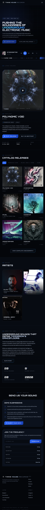

<div align="center">


# 🎵 Tinnie House Records

**A modern, responsive web application for showcasing electronic music catalog with seamless audio playback experience.**

[](https://reactjs.org/)
[](https://www.typescriptlang.org/)
[](https://vitejs.dev/)
[](https://tailwindcss.com/)
[](https://netlify.com/)

</div>

## 📋 Table of Contents

- [Overview](#overview)
- [Features](#-features)
- [Tech Stack](#-tech-stack)
- [Quick Start](#-quick-start)
- [Development](#-development)
- [Deployment](#-deployment)
- [Project Structure](#-project-structure)
- [Configuration](#-configuration)
- [Troubleshooting](#-troubleshooting)
- [Contributing](#-contributing)
- [License](#-license)

## Overview

Polished, single-page React application that showcases the Tinnie House Records catalog, artists, and audio previews. Built as a static Vite application optimized for performance and deployable to Netlify or any static hosting platform without requiring a custom backend or live database connection.

## Screenshot

<p align="center">
  
</p>

## ✨ Features
- **🎨 Modern UI**: Responsive design with Tailwind CSS and shadcn/ui components
- **🎵 Audio Playback**: Built-in music player with smooth controls and streaming support
- **🌙 Dark Mode**: System-aware theme switching with local storage persistence
- **📱 Mobile Optimized**: Fully responsive design for all device sizes
- **⚡ Fast Loading**: Static site generation with Vite for optimal performance
- **📧 Contact CTA**: Direct demo submission and newsletter request flows via email
- **🎯 SEO Ready**: Proper meta tags and semantic HTML structure
- **♿ Accessible**: WCAG compliant with keyboard navigation support

## 🛠️ Tech Stack

### Frontend Framework
- **React 18** - Modern React with concurrent features
- **TypeScript** - Type-safe development experience
- **Vite** - Lightning-fast build tool and development server

### Styling & UI
- **Tailwind CSS** - Utility-first CSS framework
- **shadcn/ui** - High-quality React components built on Radix UI
- **Radix UI** - Primitives for building accessible web applications
- **Lucide React** - Beautiful & consistent icons

### Routing & Navigation
- **Wouter** - Lightweight routing library for React

### Form Handling
- **React Hook Form** - Performant forms with easy validation
- **Zod** - TypeScript-first schema validation

### Audio & Media
- **Custom Audio Manager** - Streamlined audio playback control
- **Local Audio Storage** - Audio files served from public directory

### Development Tools
- **TypeScript** - Static type checking
- **PostCSS** - CSS processing with Autoprefixer
- **tailwindcss-animate** - Smooth animations

## 🚀 Quick Start

### Prerequisites
- **Node.js** 18+
- **npm** or **yarn** package manager

### Installation

```bash
# Clone the repository
git clone <your-repo-url>
cd tinnie-house-revamp

# Install dependencies
npm install

# Start development server
npm run dev
```

Visit `http://localhost:5173` to see the application running.

## 💻 Development

### Available Scripts

```bash
npm run dev          # Start development server
npm run build        # Build for production
npm run preview      # Preview production build locally
npm run typecheck    # Run TypeScript type checking
```

### Development Guidelines

#### Code Style
- Use TypeScript for all new components
- Follow the existing folder structure
- Use shadcn/ui components when possible
- Maintain consistent naming conventions

#### Component Structure
```typescript
// Example component structure
interface ComponentProps {
  // Define props with TypeScript
}

export function Component({ prop1, prop2 }: ComponentProps) {
  return (
    // JSX with Tailwind classes
  );
}
```

#### Adding New Features
1. Create components in `client/src/components/`
2. Add page components in `client/src/pages/`
3. Update routing in the main App component
4. Add types in `client/src/types/`

## 🚀 Deployment

### Netlify (Recommended)

1. **Build Settings:**
   - Build command: `npm run build`
   - Publish directory: `client/dist`

3. **Deploy:**
   - Connect your GitHub repository to Netlify
   - Automatic deployments on every push to main branch

### Other Platforms

The application builds to a static `client/dist` folder that can be deployed to:
- **Vercel** - Zero-config deployment
- **GitHub Pages** - Free hosting for public repos
- **Firebase Hosting** - Google's static hosting
- **AWS S3 + CloudFront** - Scalable hosting solution

### Production Build
```bash
npm run build
```

The optimized production files will be in the `client/dist` directory.

## 📁 Project Structure

```
tinnie-house-revamp/
├── 📁 client/                 # Frontend application
│   ├── 📁 public/            # Static assets
│   │   ├── 📁 audio/         # Music files & previews
│   │   ├── 📁 images/        # Images & artwork
│   │   └── favicon.png       # Site favicon
│   └── 📁 src/
│       ├── 📁 components/    # Reusable UI components
│       │   ├── 📁 ui/        # shadcn/ui components
│       │   ├── catalog-wall.tsx
│       │   ├── redesign-player.tsx
│       │   └── visualizer.tsx
│       ├── 📁 hooks/         # Custom React hooks
│       ├── 📁 lib/           # Utility functions
│       ├── 📁 pages/         # Page components
│       ├── 📁 types/         # TypeScript type definitions
│       └── App.tsx           # Main application component
├── 📄 package.json           # Dependencies & scripts
├── 📄 vite.config.ts         # Vite configuration
├── 📄 tailwind.config.ts     # Tailwind CSS configuration
├── 📄 tsconfig.json          # TypeScript configuration
└── 📄 README.md              # This file
```

## ⚙️ Configuration

### Environment Variables

Create a `.env` file in the client directory:

```bash
# Development port (default: 5173)
VITE_PORT=5173

```

### Audio Configuration

#### Local Audio Storage
Audio files are stored in `client/public/audio/` and served statically as part of the application bundle. The file paths are stored in the database's `audio_file_path` field and resolved to URLs like `/audio/artist/track.mp3`.

### Theme Customization

The application supports dark/light mode with system preference detection. Customize colors in `tailwind.config.ts`:

```typescript
export default {
  darkMode: ["class"],
  theme: {
    extend: {
      colors: {
        // Add your custom colors here
      }
    }
  }
}
```

## 🔧 Troubleshooting

### Common Issues

#### Development Server Won't Start
```bash
# Clear node_modules and reinstall
rm -rf node_modules package-lock.json
npm install
```

#### Audio Files Not Loading
- Check file paths in `client/public/audio/`
- Verify CORS settings if using external hosting
- Ensure audio files are in supported formats (MP3, WAV, OGG)

#### Build Failures
```bash
# Run type checking
npm run typecheck

# Clear Vite cache
rm -rf node_modules/.vite
```

#### Netlify Form Issues
- Ensure the site is deployed on Netlify
- Check form has `netlify` attribute
- Verify environment variables are set correctly

### Performance Optimization

#### Large Audio Files
- Compress audio files for web (320kbps MP3 recommended)
- Consider using external storage for better streaming
- Implement lazy loading for non-critical audio

#### Bundle Size
```bash
# Analyze bundle size
npm run build
npm install -g vite-bundle-analyzer
vite-bundle-analyzer client/dist
```

## 🤝 Contributing

We welcome contributions! Please follow these steps:

1. **Fork the repository**
2. **Create a feature branch**: `git checkout -b feature/amazing-feature`
3. **Make your changes** with proper TypeScript types
4. **Test thoroughly** across different devices and browsers
5. **Commit with clear messages**: `git commit -m 'Add amazing feature'`
6. **Push to your branch**: `git push origin feature/amazing-feature`
7. **Open a Pull Request** with a detailed description

### Development Setup
```bash
# Fork and clone your fork
git clone <your-fork-url>
cd tinnie-house-revamp

# Add upstream remote
git remote add upstream <original-repo-url>

# Install dependencies
npm install
```

### Pull Request Guidelines
- **Clear title and description**
- **Link related issues**
- **Include screenshots** for UI changes
- **Ensure all tests pass**
- **Follow existing code style**

## 📄 License

This project is licensed under the MIT License - see the [LICENSE](LICENSE) file for details.

---

<div align="center">

**Made with ❤️ for the electronic music community**

[](https://app.netlify.com/start/deploy?repository=https://github.com/your-username/tinnie-house-revamp)

</div>

### Highlights
- Static data sources for artists/releases with inline audio previews.
- Tailwind-based styling with shadcn/ui components and a custom theme toggle.
- Netlify-ready contact form (Netlify Forms) with client-side validation powered by React Hook Form + Zod.
- Audio files served locally from `/public/audio` directory with database-driven path resolution.

### Tech Stack
- **React 18 + TypeScript** bundled with **Vite**.
- **Tailwind CSS** with `tailwindcss-animate` and shadcn/ui primitives (Radix UI).
- **Wouter** for lightweight routing.
- **Zod** & **React Hook Form** for robust form handling.

### Getting Started
```bash
npm install
npm run dev
```

The dev server runs on Vite (defaults to port `5173`). Audio files live under `client/public/audio`.

### Production Build
```bash
npm run build
```

The command outputs to `client/dist`. Point Netlify (or your host) at that directory with the build command `npm run build`.

### Project Structure
```
client/
  public/           # static assets (audio, images)
  src/
    components/     # shadcn/ui wrappers + feature components
    lib/            # utilities (audio manager, theme provider, etc.)
    pages/          # page-level React components
    static-content.ts
    types/          # shared TypeScript types
```

### Deployment Tips
- Audio files are bundled with the application and served statically from `/audio/` URLs.
- The demo submission link and newsletter request use the visitor's email client, so they work on any static host.
